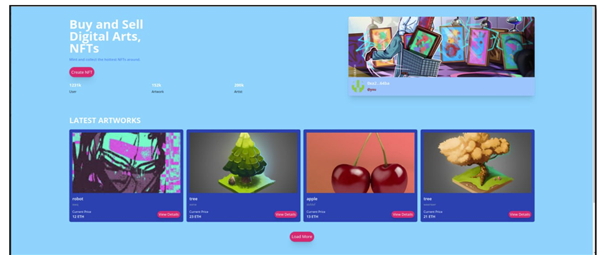
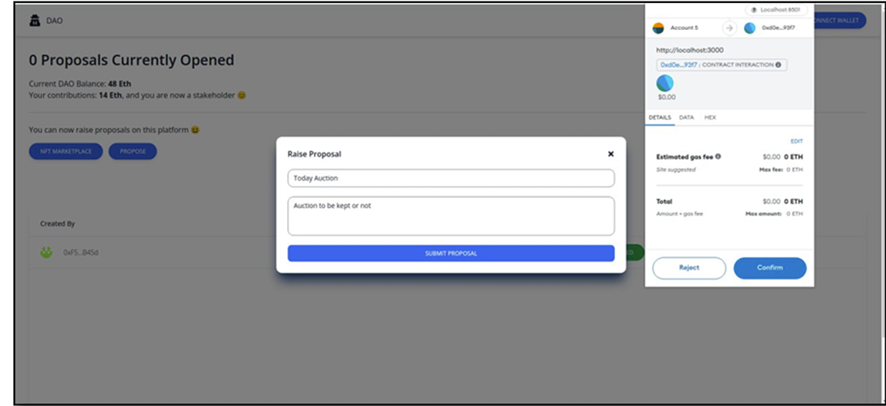

# NFT-Marketplace-and-DAO
This project hosts a custom blockchain-based application: Integrated NFT Marketplace and DAO on a custom DPoS-Based blockchain network.

## NFT-Marketplace and DAO
NFT marketplace is a blockchain application used to buy and sell NFT tokens. It allows users to mint NFTs, trade them on a secure platform, and ensures transparency via blockchain technology.

  
*Image 1: NFT Marketplace Interface*

---

## Decentralized Autonomous Organization (DAO)
DAO is another blockchain application used to make decisions within an organization, with respect to each shareholder's opinion, weighted by their share ratio. This enables decentralized governance and decision-making.

  
*Image 2: DAO Voting Interface*

---

## Run the Blockchain Network:

To run the demo follow these steps:

1. Clone the project with the code below.  
   **Ensure you have the required prerequisites installed!**
   ```bash
   git clone https://github.com/Daltonic/dominionDAO PROVIDER_NAME
   cd PROVIDER_NAME # Navigate to the new folder.
  '''
2. Install all dependencies:
  ```bash
    yarn install
  ```
3. Create an Infura project, and copy and paste your key in the spaces below.
4. Update the .env file with the following details:
``` bash
  ENDPOINT_URL=<PROVIDER_URL>
  SECRET_KEY=<SECRET_PHRASE>
  DEPLOYER_KEY=<YOUR_PRIVATE_KEY>
```
5. Create a CometChat project, and copy and paste your key in the spaces below:
   ```bash
   REACT_APP_COMET_CHAT_REGION=<REGION>
    REACT_APP_COMET_CHAT_APP_ID=<APP_ID>
    REACT_APP_COMET_CHAT_AUTH_KEY=<AUTH_KEY>
   ```
6. Run the app:
```bash
  yarn start
```

## How It Works
NFT Marketplace: Users can mint and trade NFTs securely.
DAO: Stakeholders can create and vote on proposals based on their holdings.


